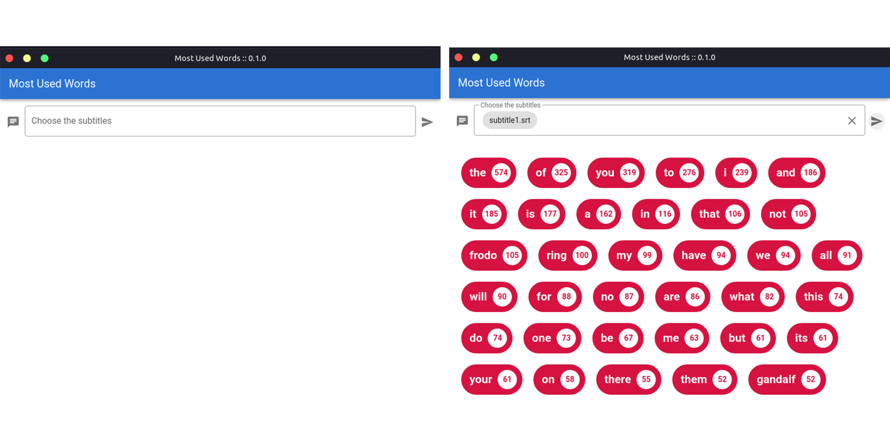

# most-used-words
Most Used Words is a desktop application that verifies into a subtitle file what was the words which most repeated throughout the file.

## Most Used Words was built using:
- Vue.js
- Vuetify
- Electron.js

## Clone project
```
git clone https://github.com/Reingaw/most-used-words
```

## Project setup
```
npm install
```

### Compiles and hot-reloads for development
```
npm run electron:serve
```

## Preview
